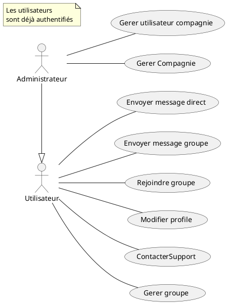

```plantuml
@startuml
note "Les utilisateurs \nsont déjà authentifiés" as n
left to right direction

Utilisateur--(Envoyer message direct)
Utilisateur--(Envoyer message groupe)
Utilisateur--(Rejoindre groupe)
Utilisateur--(Modifier profile)
Utilisateur--(ContacterSupport)
Utilisateur--(Gerer groupe)


Administrateur--(Gerer utilisateur compagnie)
Administrateur--(Gerer Compagnie)


Administrateur -|> Utilisateur 

@enduml
```